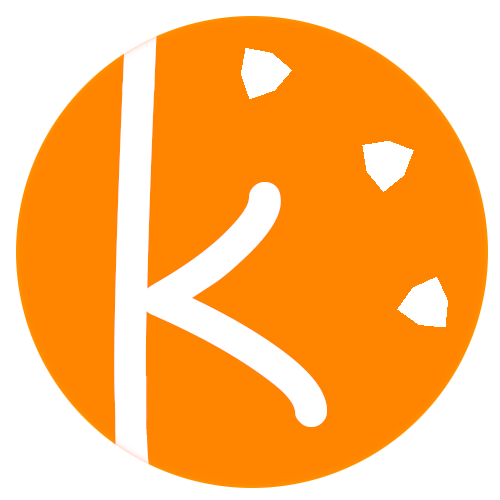

<div id="top"></div>
<!--
I'm using the awesome README template from:
https://github.com/othneildrew/Best-README-Template
-->

<!-- PROJECT SHIELDS
see:
https://www.markdownguide.org/basic-syntax/#reference-style-links
-->
[![Contributors][contributors-shield]][contributors-url]
[![Forks][forks-shield]][forks-url]
[![Stargazers][stars-shield]][stars-url]
[![Issues][issues-shield]][issues-url]
[![MIT License][license-shield]][license-url]
<!--[![LinkedIn][linkedin-shield]][linkedin-url]-->


<!-- PROJECT LOGO -->
<br />
<div align="center">
  <a href="https://github.com/ndoxx/kibble">
    
  </a>

<h3 align="center">Kibble</h3>

  <p align="center">
    A utility library to jumpstart my projects.
    <br />
    <br />
    <a href="https://github.com/ndoxx/kibble/issues">Report Bug</a>
    ·
    <a href="https://github.com/ndoxx/kibble/issues">Request Feature</a>
  </p>
</div>

<!-- TABLE OF CONTENTS -->
<strong> Table of contents </strong>

- [About the project](#about-the-project)
  - [Kibble](#kibble)
  - [Feature list](#feature-list)
- [Getting started](#getting-started)
  - [Prerequisites](#prerequisites)
  - [Installation](#installation)
  - [Examples and tests](#examples-and-tests)
  - [Documentation](#documentation)
  - [Integration](#integration)
- [How to help](#how-to-help)
- [License](#license)
- [Contact](#contact)

<!-- ABOUT THE PROJECT -->
# About the project

## Kibble

This C++ library is a collection of utility classes, systems, data structures, algorithms and tools I happen to need quite often in my game development projects. Most of the code is original, some parts stemmed from other open source projects or blog articles I read.<br/>
There are numerous examples on how to use it, and most of the code is unit tested.

At the moment, the code has only been tested under GNU/Linux, and although most of it should compile and work as-is under other operating systems, some OS-dependent code was only implemented for GNU/Linux.<br/>
This library is under heavy development, and the API is subject to change. Use at your own risk!

## Feature list

* Logger
    - Channel-based system with runtime verbosity levels
    - Extendable sink system (out-of-the-box sinks: console, file and TCP)
    - Extendable formatters
    - Extendable policy system for filtering / transforming log data
    - Output is formatted, color coded and easy to follow
    - fmtlib-style syntax
    - Synchronous and asynchronous operation (both thread-safe)
    - Optional stack trace on error
* Program argument parser
    - Automatically generate usage string and version
    - Modern interface
* File system
    - Handles regular files as well as files inside a resource pack
    - Directory / pack aliasing and universal paths
    - Can create and maintain a config directory located where the OS expects it
    - The kpack utility can pack a directory easily, it can also be done programmatically
    - Safe file saving utility to avoid overwriting files with bad data
    - MD5 checksum computation
* Custom assertion
    - More helpful assert macro, user can debug break / continue / print stack trace / exit
    - Formatted assertion message strings
* Profiling utility
    - Easily profile execution time
    - Produce a Chrome Tracing json output
* Config system
    - Read and save settings from / to multiple TOML files with a single structure
    - Each property is referenced by an intuitive hash string reflecting the property's hierarchy
* Event system
    - Publish / subscribe model with central message broker (event bus)
    - Deferred event handling with event queues
    - Events can also be fired instantly
    - Abstract delegates allow subscription of free functions as well as member functions
    - Events need not inherit from a base class and can be any type
    - Subscriber priority system to decide which subscribers should respond first
    - Events can be consumed
    - Event tracking / logging
* Job system
    - Launch multiple worker threads and execute tasks asynchronously
    - Lock-free
    - Work stealing scheme for load balancing
    - Dependency graph
    - Worker affinity
    - Recurring tasks
    - Task monitoring and profiling (using the profiling utility)
* Undo engine
    - Qt-like API
    - Push custom commands in a stack-like object that handles the undo / redo logic
    - Manage multiple stacks in an undo group
    - Command merging and compression
    - Clean state
    - Can be wired to an event system thanks to various callbacks
* Random number generation
    - Fast XOR shift engine
    - Coherent noise generation (simplex, octave)
* UUIDv4 generation
    - adapted from: [https://github.com/crashoz/uuid_v4](https://github.com/crashoz/uuid_v4)
* Multiple math utilities
    - Bezier and cubic Hermite spline interpolation (arc-length parameterized)
    - Catenary curve (arc-length parameterized)
    - Constexpr math function collection
    - Easing functions (a lot of them)
    - Separable Gaussian convolution kernel builder
    - Numerical methods (Newton-Raphson, Simpson integration)
    - Statistics class (useful for profiling)
    - Colors: multiple representations (RGBA, HSLA, CIELab, 32b ARGB) and conversion algorithms,
      multiple color difference algorithms...
* Mathematical optimization and graph algorithms
    - Generic stochastic descent optimizer with FDSA / SPSA support
    - Generic A* search implementation
* Constexpr string hashes and intern string system
    - User defined literal allows to write a full string in the source that will be hashed at compile-time
    - The internstring utility can parse sources and write all string hashes to a text file,
      then it's quite simple to resolve a hash at runtime by reading this file into a map
* Multiple string utilities to avoid boilerplate
    - trimming, stripping, case transform, text centering, tokenization, regex replace
    - Base64 encoding / decoding
* Compile-time type information
    - Drop-in replacement for some features of the CTTI lib
    - Compile-time type name and type ID (as a name hash)
* Memory arena system
    - Fast custom allocators (linear, pool, atomic pool, TLSF)
* Basic TCP socket abstraction
    - Simple Berkeley socket wrapper using the Stream / Acceptor / Connector model
* A precision chronometer with a simple interface
* Multiple useful data structures, including sparse sets and sparse pools implementations

<p align="right">(<a href="#top">back to top</a>)</p>


## Deprecated components

The old logger `logger/logger.h` was kept in this library, as many of my projects still use it. However, a faster and more customizable logger has been created, and is accessible through the `logger2/logger.h` header. All systems of this library now use the new logger.


<!-- GETTING STARTED -->
# Getting started

To get a local copy up and running follow these steps.

## Prerequisites

* A compiler with support for C++20 (tested with clang 12.0.0)
* CMake, minimum version 3.19

## Installation

1. Clone the repo with its submodules
   ```sh
   git clone --recurse-submodules https://github.com/ndoxx/kibble.git
   ```
2. Build the lib
   ```sh
    mkdir build
    cd build
    cmake ..
    make kibble
   ```
3. Install
   ```sh
    sudo make install
   ```

## Examples and tests

Some of the examples may require additional dependencies like [glm](https://github.com/g-truc/glm) to compile.<br/>
To build the examples and tests, make sure you are in the `build` directory.

* You can build every example from the source/examples directory individually with
  ```sh
   make ex_<example_name>
  ```
  Replace `<example_name>` by the file name stem.
* Or you can build all of them at once with
  ```sh
   make examples
  ```
* To build the unit tests:
  ```sh
   make test_kibble
  ```

<p align="right">(<a href="#top">back to top</a>)</p>

## Documentation

The source files are documented with Doxygen, and higher-level documentation is on its way. To build the docs, go to the `build` directory and do:
```sh
  make docs
```

## Integration

Kibble can be setup as a subproject easily with CMake and git. Add Kibble as a submodule, and in the relevant `CMakeLists.txt` configure the project with `set()` directives, then simply call `add_subdirectory()`. Kibble's CMake script will detect its use as a subproject, disable the tests, examples and install targets, and let the host project handle the configuration of the output directories. For example:

```cmake
set(KB_AREA_MEMORY_INITIALIZATION ON CACHE BOOL "" FORCE)
set(KB_JOB_SYSTEM_PROFILING ON CACHE BOOL "" FORCE)
set(KB_MORTON_INTRIN ON CACHE BOOL "" FORCE)
add_subdirectory("${CMAKE_SOURCE_DIR}/source/vendor/kibble" "external/kibble")

set_target_properties(kibble
    PROPERTIES
    POSITION_INDEPENDENT_CODE ON
)
```

Then link your executable / library against the `kibble` target. That's it.


<!-- CONTRIBUTING -->
# How to help
If you have any idea on how to make this project better, please fork the repo and create a pull request. You can also simply open an issue with the tag "enhancement". Any contribution will be **greatly appreciated**.


1. Fork the Project
2. Create your Feature Branch (`git checkout -b feature/FeatureName`)
3. Commit your Changes (`git commit -m 'Add this awesome feature'`)
4. Push to the Branch (`git push origin feature/FeatureName`)
5. Open a Pull Request

If this project was of any help to you, don't hesitate to give it a star!

<p align="right">(<a href="#top">back to top</a>)</p>


<!-- LICENSE -->
# License

Distributed under the MIT License. See `LICENSE.txt` for more information.

<p align="right">(<a href="#top">back to top</a>)</p>


<!-- CONTACT -->
# Contact

Ndoxx - dev.ndoxx@gmail.com

Project Link: [https://github.com/ndoxx/kibble](https://github.com/ndoxx/kibble)

<p align="right">(<a href="#top">back to top</a>)</p>


<!-- MARKDOWN LINKS & IMAGES -->
<!-- https://www.markdownguide.org/basic-syntax/#reference-style-links -->
[contributors-shield]: https://img.shields.io/github/contributors/ndoxx/kibble.svg?style=for-the-badge
[contributors-url]: https://github.com/ndoxx/kibble/graphs/contributors
[forks-shield]: https://img.shields.io/github/forks/ndoxx/kibble.svg?style=for-the-badge
[forks-url]: https://github.com/ndoxx/kibble/network/members
[stars-shield]: https://img.shields.io/github/stars/ndoxx/kibble.svg?style=for-the-badge
[stars-url]: https://github.com/ndoxx/kibble/stargazers
[issues-shield]: https://img.shields.io/github/issues/ndoxx/kibble.svg?style=for-the-badge
[issues-url]: https://github.com/ndoxx/kibble/issues
[license-shield]: https://img.shields.io/github/license/ndoxx/kibble.svg?style=for-the-badge
[license-url]: https://github.com/ndoxx/kibble/blob/master/LICENSE.txt
[linkedin-shield]: https://img.shields.io/badge/-LinkedIn-black.svg?style=for-the-badge&logo=linkedin&colorB=555
[linkedin-url]: https://linkedin.com/in/linkedin_username
[product-screenshot]: images/screenshot.png